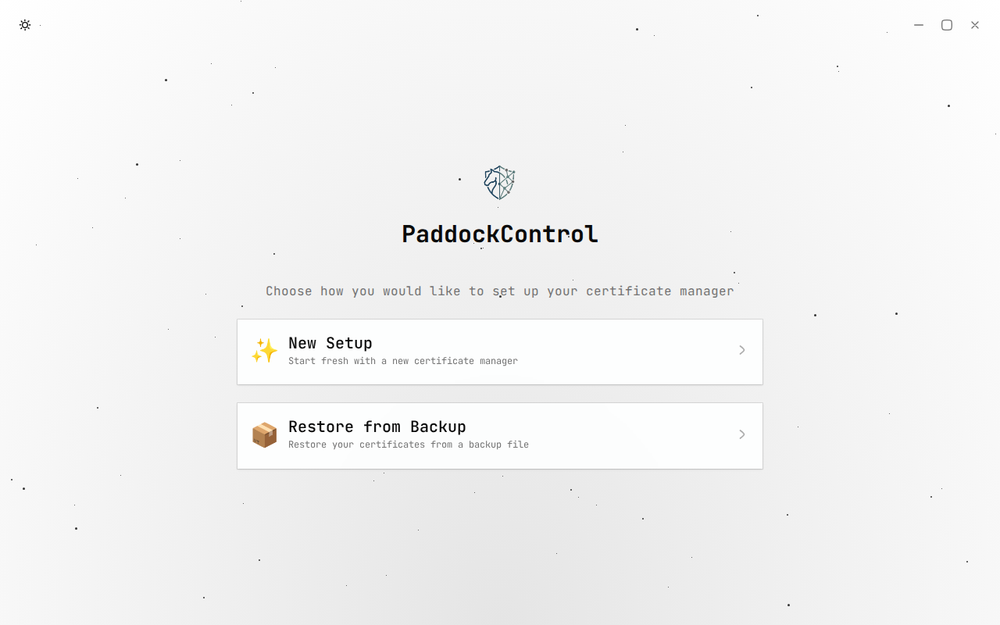
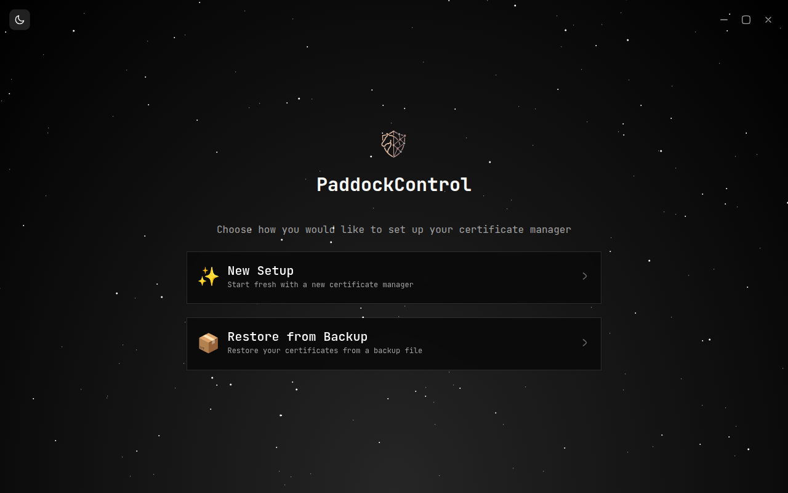
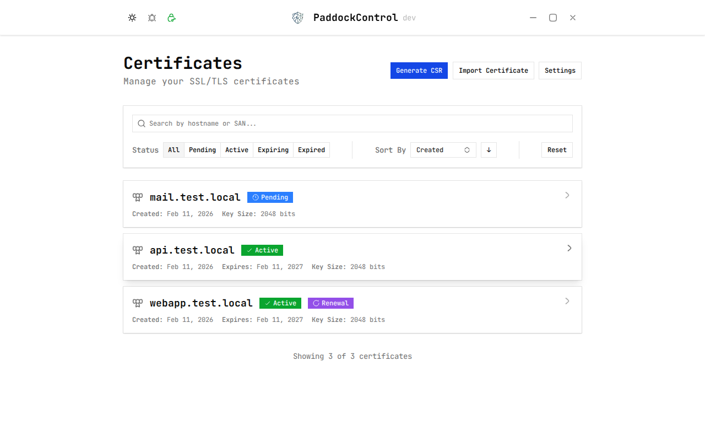
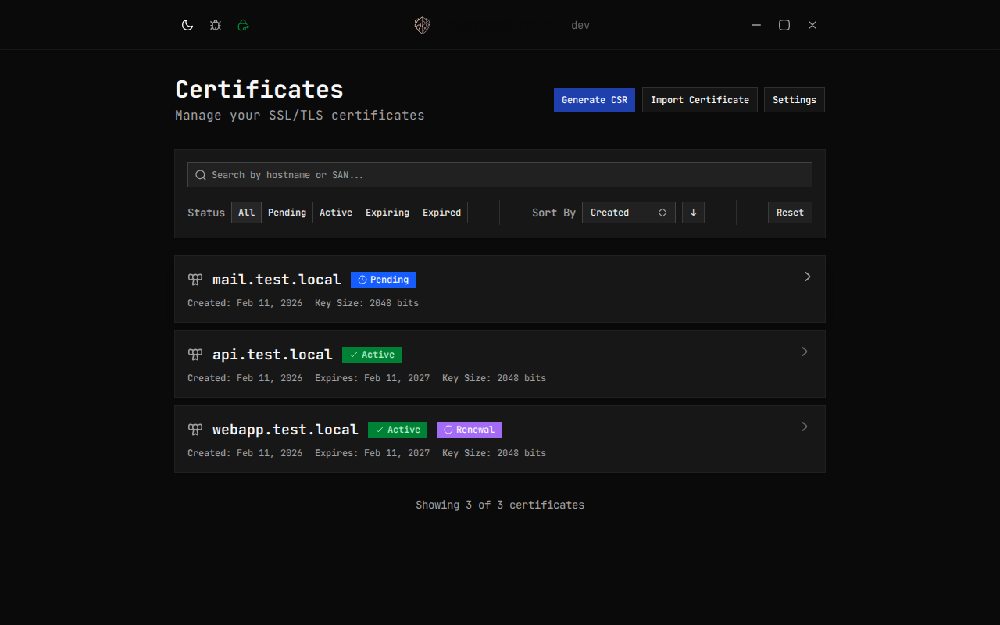
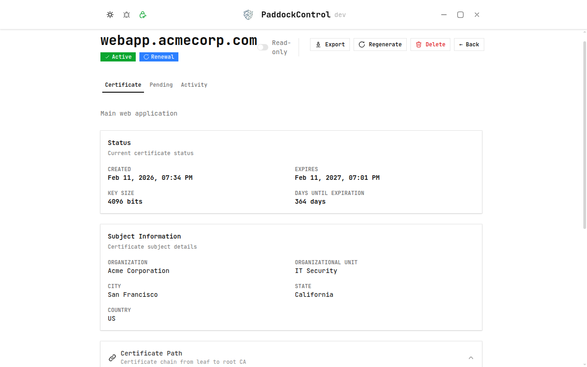
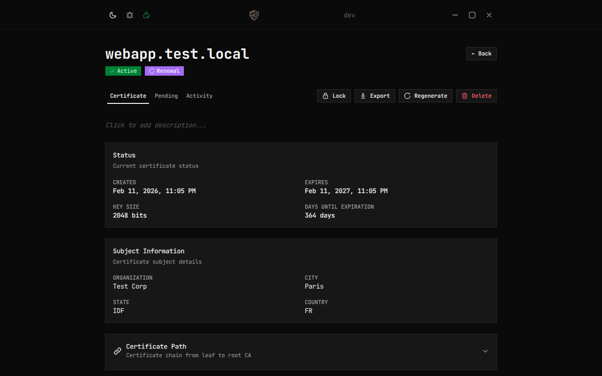

# PaddockControl Desktop

A desktop certificate management app for teams that handle SSL/TLS certificates with internal CAs.

## About

PaddockControl Desktop simplifies the certificate lifecycle for organizations using internal Certificate Authorities. Generate CSRs, track certificate status, store private keys with AES encryption, and never lose track of expiring certificates again. Built with Go and React, it runs natively on Windows with auto-updates.

## Screenshots

### Welcome

| Light | Dark |
|-------|------|
|  |  |

### Dashboard

| Light | Dark |
|-------|------|
|  |  |

### Certificate Detail

| Light | Dark |
|-------|------|
|  |  |

## Features

- Generate CSRs with RSA 4096-bit keys
- Track certificate status (pending / active / expiring / expired)
- Import existing certificates
- AES-encrypted private key storage
- Backup & restore
- Dark / light theme
- Auto-updates
- Search & filter certificates

## Tech Stack

Go &middot; Wails v2 &middot; React 19 &middot; TypeScript &middot; SQLite &middot; Tailwind CSS v4

## Download

Download the latest Windows installer from [GitHub Releases](https://github.com/MokoGuy/paddockcontrol-desktop/releases/latest).

## Contributing

Contributions are welcome! See [CONTRIBUTING.md](CONTRIBUTING.md) for dev setup, commands, and conventions.

## License

MIT &mdash; see [LICENSE](LICENSE).
